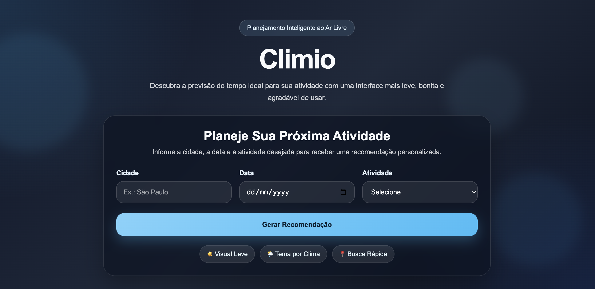
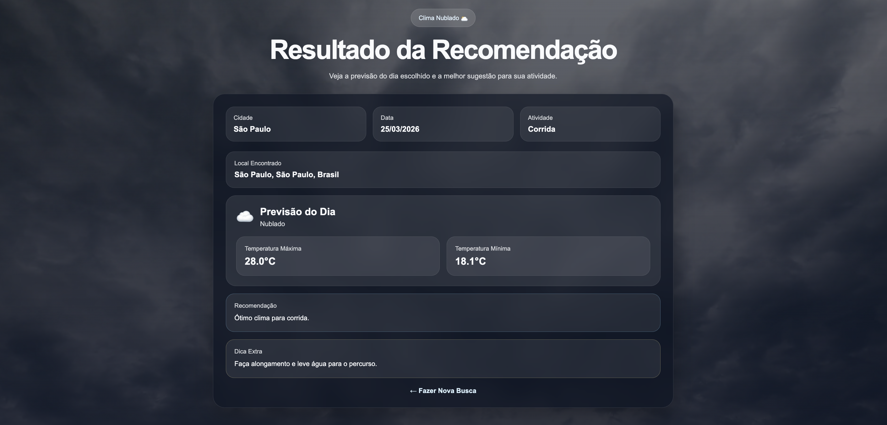

# 🌤️ Climio

Climio é uma aplicação web desenvolvida com Spring Boot que sugere atividades ao ar livre com base na previsão do tempo em tempo real.

A proposta é simples: o usuário informa uma cidade, uma data e uma atividade, e o sistema retorna a previsão climática junto com uma recomendação personalizada para aquela situação.

---

## 💡 Objetivo

Esse projeto foi desenvolvido com foco em prática e evolução técnica, principalmente para:

- Trabalhar com integração de APIs externas
- Praticar arquitetura em camadas (Controller, Service e DTO)
- Desenvolver uma aplicação completa (front-end + back-end)
- Melhorar o tratamento de dados e validações de entrada

Também é um projeto voltado para portfólio, com o objetivo de demonstrar minhas habilidades como desenvolvedora, desde a construção da lógica até a experiência do usuário.

---

## 🚀 Tecnologias utilizadas

- Java 21
- Spring Boot
- Thymeleaf
- Maven
- HTML5 + CSS3
- Open-Meteo API (previsão do tempo)
- Nominatim API (geolocalização)

---

## 🧠 Como funciona

O fluxo da aplicação é:

1. O usuário informa cidade, data e atividade
2. A cidade é validada e normalizada (incluindo tratamento de acentos)
3. A localização é obtida via API Nominatim
4. A previsão do tempo é consultada via Open-Meteo
5. O clima é interpretado internamente (códigos → condições)
6. Uma recomendação é gerada com base no clima e na atividade
7. O resultado é exibido com tema visual dinâmico

---

## 🎨 Funcionalidades

- Busca de cidades com suporte a acentos (ex: "São Paulo" e "Sao Paulo")
- Validação de entradas para evitar resultados incorretos
- Previsão do tempo por data específica
- Sugestões de atividades ao ar livre:
    - Caminhada
    - Corrida
    - Trilha
    - Bike
    - Praia
- Recomendações personalizadas baseadas no clima
- Dicas extras (ex: levar água, guarda-chuva, roupas adequadas)
- Interface com tema dinâmico de acordo com o clima
- Vídeo de fundo que acompanha a condição climática

---

## 🧪 Tratamento de cenários

O projeto também trata diversos casos reais, como:

- Diferença entre cidades com e sem acento
- Evita correspondências incorretas da API
- Rejeita entradas inválidas (ex: "Beléem", nomes inexistentes)
- Limita a tolerância de erros para evitar resultados aleatórios
- Exibe mensagens amigáveis em caso de erro

---

## 🛠️ Como rodar o projeto

Clone o repositório:

```bash
git clone https://github.com/vitoria-candido/climio.git
```

Acesse a pasta do projeto:

```bash
cd climio
```

Execute a aplicação:

```bash
./mvnw spring-boot:run
```

Acesse no navegador:

```text
http://localhost:8080
```

---

## 📌 Observações

- O projeto não utiliza banco de dados
- Os dados são obtidos em tempo real via APIs públicas
- Foco em código limpo, organização e separação de responsabilidades
- Aplicação pensada para simular um cenário real de uso

---

## 📷 Preview

### Tela inicial


### Tela de resultado


---

## 👩‍💻 Sobre mim

Desenvolvido por Vitória Candido.

Esse projeto faz parte da minha evolução na área de desenvolvimento de software, com foco em construção de aplicações completas, boas práticas e experiência do usuário.